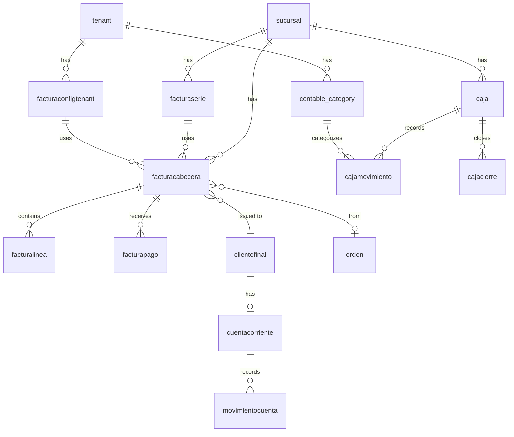

# Modelo de Datos — Módulo Contable

## Diagrama ER



## Tablas Existentes

### Facturación
| Tabla | Descripción | Tenant Isolation |
|-------|-------------|------------------|
| `facturaserie` | Series de numeración | Via sucursal→tenant |
| `facturaconfigtenant` | Diseño de facturas | `id_tenant` directo |
| `facturacabecera` | Cabecera facturas | Via sucursal→tenant |
| `facturalinea` | Líneas de factura | Via factura→sucursal |
| `facturapago` | Pagos asociados | Via factura→sucursal |

### Caja
| Tabla | Descripción | Tenant Isolation |
|-------|-------------|------------------|
| `caja` | Cajas por sucursal | Via sucursal→tenant |
| `cajamovimiento` | Movimientos de caja | Via caja→sucursal |
| `cajacierre` | Registros de cierre | Via caja→sucursal |
| `cajachica` | Caja chica sucursal | Via sucursal→tenant |
| `cajachicamovimiento` | Movimientos caja chica | Via cajachica→sucursal |

### Cuentas Corrientes
| Tabla | Descripción | Tenant Isolation |
|-------|-------------|------------------|
| `cuentacorriente` | Cuenta por cliente | `id_tenant` directo |
| `movimientocuenta` | Movimientos CC | Via cuenta→tenant |

## Tablas a Crear (Fase 2)

### `contable_bill` — Facturas Recibidas (Proveedores)
```sql
CREATE TABLE contable_bill (
    id              BIGSERIAL PRIMARY KEY,
    id_tenant       BIGINT NOT NULL REFERENCES tenant(id),
    id_sucursal     BIGINT NOT NULL REFERENCES sucursal(id),
    id_proveedor    BIGINT NOT NULL REFERENCES proveedor(id),
    numero_factura  TEXT NOT NULL,
    fecha_emision   DATE NOT NULL,
    fecha_recepcion DATE NOT NULL DEFAULT current_date,
    fecha_vencimiento DATE,
    base_imponible  NUMERIC(14,2) NOT NULL DEFAULT 0,
    importe_iva     NUMERIC(14,2) NOT NULL DEFAULT 0,
    total           NUMERIC(14,2) NOT NULL DEFAULT 0,
    estado          TEXT NOT NULL DEFAULT 'PENDIENTE' 
                    CHECK (estado IN ('PENDIENTE','PAGADA','ANULADA')),
    pdf_url         TEXT,
    observaciones   TEXT,
    created_at      TIMESTAMPTZ NOT NULL DEFAULT now(),
    created_by      BIGINT NOT NULL REFERENCES usuario(id),
    
    CONSTRAINT ux_bill_tenant_numero UNIQUE (id_tenant, numero_factura, id_proveedor)
);

CREATE INDEX idx_bill_tenant_fecha ON contable_bill(id_tenant, fecha_emision DESC);
CREATE INDEX idx_bill_estado ON contable_bill(id_tenant, estado);
```

### `contable_bill_line` — Líneas Factura Recibida
```sql
CREATE TABLE contable_bill_line (
    id              BIGSERIAL PRIMARY KEY,
    id_bill         BIGINT NOT NULL REFERENCES contable_bill(id) ON DELETE CASCADE,
    descripcion     TEXT NOT NULL,
    cantidad        NUMERIC(12,3) NOT NULL DEFAULT 1,
    precio_unitario NUMERIC(14,4) NOT NULL,
    iva_pct         NUMERIC(5,2) NOT NULL DEFAULT 21,
    base_imponible  NUMERIC(14,2) NOT NULL,
    importe_iva     NUMERIC(14,2) NOT NULL,
    total_linea     NUMERIC(14,2) NOT NULL,
    id_categoria    BIGINT REFERENCES contable_category(id),
    posicion        SMALLINT NOT NULL
);

CREATE INDEX idx_bill_line_bill ON contable_bill_line(id_bill);
```

### `contable_category` — Categorías Contables
```sql
CREATE TABLE contable_category (
    id          BIGSERIAL PRIMARY KEY,
    id_tenant   BIGINT NOT NULL REFERENCES tenant(id),
    codigo      TEXT NOT NULL,
    nombre      TEXT NOT NULL,
    tipo        TEXT NOT NULL CHECK (tipo IN ('INGRESO','GASTO')),
    activo      BOOLEAN NOT NULL DEFAULT true,
    created_at  TIMESTAMPTZ NOT NULL DEFAULT now(),
    
    CONSTRAINT ux_category_tenant_codigo UNIQUE (id_tenant, codigo)
);

CREATE INDEX idx_category_tenant_tipo ON contable_category(id_tenant, tipo);
```

### `audit_log` — Log de Auditoría (Global)
```sql
CREATE TABLE IF NOT EXISTS audit_log (
    id          BIGSERIAL PRIMARY KEY,
    id_tenant   BIGINT NOT NULL REFERENCES tenant(id),
    id_usuario  BIGINT NOT NULL REFERENCES usuario(id),
    accion      TEXT NOT NULL,
    entidad     TEXT NOT NULL,
    id_entidad  BIGINT,
    datos       JSONB,
    ip_address  INET,
    user_agent  TEXT,
    request_id  UUID,
    created_at  TIMESTAMPTZ NOT NULL DEFAULT now()
);

CREATE INDEX idx_audit_tenant_fecha ON audit_log(id_tenant, created_at DESC);
CREATE INDEX idx_audit_entidad ON audit_log(id_tenant, entidad, id_entidad);
CREATE INDEX idx_audit_usuario ON audit_log(id_tenant, id_usuario);
```

## Estrategia Multi-Tenant

### Regla de Oro
> **Todas las queries DEBEN usar `getTenantDb(ctx)` para garantizar aislamiento.**

### Índices Compuestos Recomendados
```sql
-- Búsquedas frecuentes por tenant + fecha
CREATE INDEX idx_factura_tenant_fecha 
    ON facturacabecera((SELECT id_tenant FROM sucursal WHERE id = id_sucursal), fecha_emision DESC);

-- Alternativa más simple: añadir id_tenant a tablas que no lo tienen
ALTER TABLE facturacabecera ADD COLUMN id_tenant BIGINT REFERENCES tenant(id);
-- Luego poblar con: UPDATE facturacabecera fc SET id_tenant = s.id_tenant FROM sucursal s WHERE fc.id_sucursal = s.id;
```

## Constraints de Integridad

### Facturas
- `UNIQUE(id_serie, correlativo)` — Numeración continua
- `UNIQUE(id_sucursal, numero_factura)` — No duplicados por sucursal
- `CHECK(total >= 0)` — No totales negativos
- `CHECK(base_imponible + importe_iva = total)` — Consistencia IVA

### Caja
- `CHECK(estado IN ('ABIERTA', 'CERRADA'))` — Estados válidos
- Solo una caja ABIERTA por sucursal (constraint lógico en service)

### Cuentas Corrientes
- `CHECK(saldo_actual IS NOT NULL)` — Siempre debe haber saldo
- Movimientos deben actualizar saldo en transacción
