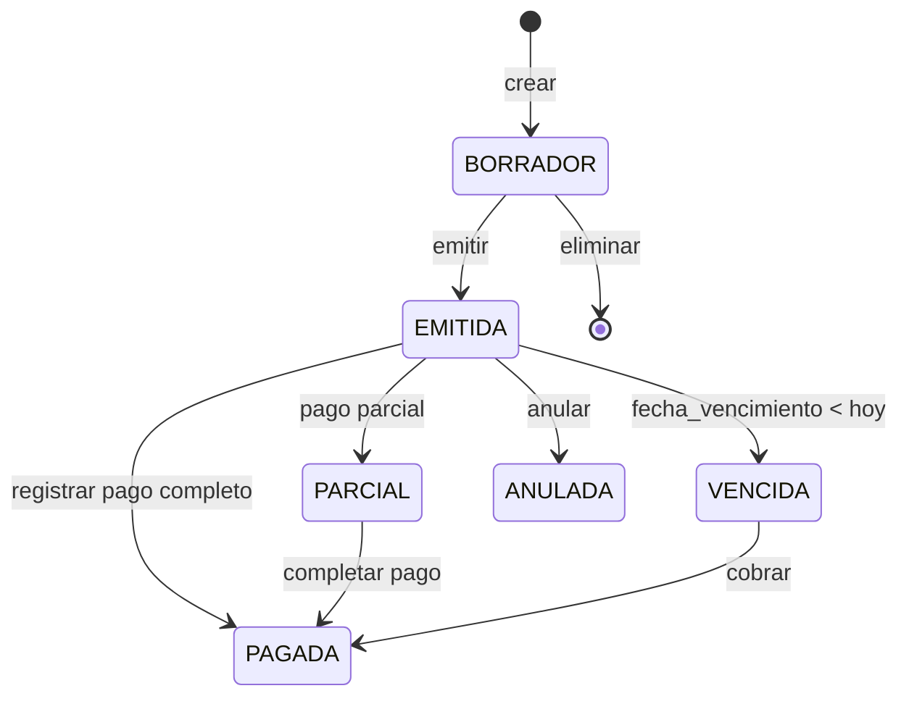

# Módulo Contable V2

## Objetivo
Centralizar la gestión financiera del negocio: facturación (emitida y recibida), flujos de caja, cuentas por cobrar/pagar, cumplimiento fiscal (IVA) y reportes contables. Proveer una base sólida para escalar a 20+ usuarios con separación multi-tenant, RBAC granular y auditoría completa.

## Alcance

### ✅ Incluye (Fase 1-3)
| Bloque | Descripción | Fase |
|--------|-------------|------|
| **Facturación Emitida** | Facturas a clientes desde órdenes de taller o venta directa | 1 |
| **Facturación Recibida** | Facturas de proveedores (compras) | 2 |
| **Caja y Movimientos** | Ingresos/egresos, apertura/cierre, caja chica | 1 |
| **Cuentas Corrientes** | Saldos cliente/proveedor, cobros, pagos | 1 |
| **Reportes IVA** | Libro IVA repercutido/soportado, resumen trimestral | 2 |
| **Dashboard Contable** | KPIs financieros consolidados | 2 |
| **Audit Log** | Trazabilidad de acciones críticas contables | 2 |
| **Export** | CSV/XLS de facturas, movimientos, libros | 3 |
| **Integraciones** | Stripe sync, import banco | 3 |

### ❌ NO Incluye
- Gestión de la operación técnica del taller (Módulo Taller)
- Logística de envíos (Módulo Marketplace)
- Contabilidad general (plan de cuentas, asientos) — fuera de alcance para V2
- Facturación electrónica certificada (SII, AFIP) — futuro

## Flujo de Estados — Factura



## Arquitectura Interna

```
src/modules/contable/
├── api/
│   ├── contable.routes.js      # Router principal (monta sub-routers)
│   ├── invoices.routes.js      # Facturas emitidas/recibidas
│   ├── cash.routes.js          # Caja y movimientos
│   ├── accounts.routes.js      # Cuentas corrientes
│   ├── reports.routes.js       # Reportes IVA, export
│   └── controllers/
│       ├── invoices.controller.js
│       ├── cash.controller.js
│       ├── accounts.controller.js
│       └── reports.controller.js
├── application/
│   └── services/
│       ├── invoice.service.js
│       ├── cash.service.js
│       ├── accounts.service.js
│       └── reports.service.js
├── domain/
│   ├── types/
│   │   ├── invoice.types.js
│   │   └── movement.types.js
│   └── rules/
│       ├── invoice.rules.js    # Validaciones de negocio
│       └── vat.rules.js        # Cálculos IVA
├── infra/
│   └── repos/
│       ├── invoice.repo.js
│       ├── cash.repo.js
│       └── accounts.repo.js
├── validation/
│   └── schemas/
│       ├── invoice.schema.js
│       └── movement.schema.js
├── docs/
│   ├── module.md               # Este archivo
│   ├── endpoints.md
│   ├── permissions.md
│   └── data-model.md
└── __tests__/
    └── smoke.test.js
```

## Roadmap de Fases

### Fase 1: Consolidación (MOD-CONTABLE-02 a 04)
- Migrar código legacy a nueva estructura modular
- Añadir tenant context obligatorio en todas las queries
- Implementar RBAC en todos los endpoints

### Fase 2: Completud (MOD-CONTABLE-05 a 07)
- Facturas recibidas (proveedores)
- Reportes IVA trimestral
- Dashboard contable unificado
- Audit log para acciones críticas

### Fase 3: Integraciones (MOD-CONTABLE-08+)
- Sync con pagos Stripe
- Import/conciliación bancaria
- Export CSV/XLS

## Riesgos y Mitigaciones

| Riesgo | Impacto | Mitigación |
|--------|---------|------------|
| Descuadre de caja | Alto | FK obligatoria a movimiento por cada venta/compra |
| Numeración duplicada | Alto | SELECT FOR UPDATE + UNIQUE constraint |
| Cross-tenant leak | Crítico | Wrapper `getTenantDb` obligatorio |
| IVA incorrecto | Alto | Redondeo a 2 decimales, validación en service |
