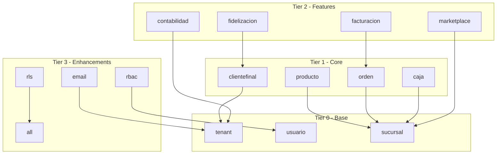

# VERSA Database Migrations Inventory

> **Generated**: 2026-01-19  
> **Status**: FASE 0 - Análisis Inicial  
> **Author**: Migration Consolidation Project

---

## Executive Summary

| Metric | Count |
|--------|-------|
| **Official Knex Migrations** (`db/migrations/`) | 7 |
| **Loose SQL Files** (`migrations/`) | 47 |
| **Loose JS Runners** (`migrations/`) | 22 |
| **Legacy Archive** (`legacy/sql-migrations/`) | 49 |
| **Total to Convert** | ~47 SQL + ~10 JS runners |

> [!IMPORTANT]
> El directorio oficial de Knex es `backend/db/migrations/`. 
> Los 69 archivos en `backend/migrations/` NO son ejecutados por `npm run migrate:latest`.

---

## Current State Summary

### 1. Official Knex Directory: `backend/db/migrations/`

Configurado en `knexfile.js` línea 36. Este es el **único** directorio que Knex reconoce.

| File | Type | Status |
|------|------|--------|
| `20260113000000_baseline.js` | Baseline marker | ✅ Active |
| `20260113170000_enable_rls_phase1.js` | RLS policies | ✅ Active |
| `20260113180000_add_clientes_vehiculos_permissions.js` | RBAC perms | ✅ Active |
| `20260115000000_fiscal_profile.js` | Fiscal tables | ✅ Active |
| `20260115000001_tax_rules_es.js` | Tax rules | ✅ Active |
| `20260115000002_alter_factura_fiscal.js` | Fiscal columns | ✅ Active |
| `20260115000003_add_retiro_type.js` | Retiro type | ✅ Active |
| `_template.js.example` | Template | N/A |

### 2. Loose Files: `backend/migrations/` (⚠️ NOT TRACKED BY KNEX)

Este directorio contiene archivos que **alguien debe ejecutar manualmente** - esto rompe reproducibilidad.

---

## Detailed Inventory: `backend/migrations/*.sql`

### Core Schema (Create Tables)

| File | Type | Dependencies | Idempotent | Risk | Status |
|------|------|--------------|------------|------|--------|
| `create_accounting_empresa.sql` | CREATE | tenant, usuario | ✅ IF NOT EXISTS | Bajo | ⏳ Pendiente |
| `create_billing_enhancements.sql` | CREATE/ALTER | tenant, suscripcion | ✅ Parcial | Medio | ⏳ Pendiente |
| `create_cliente_notificaciones.sql` | CREATE | clientefinal | ✅ IF NOT EXISTS | Bajo | ⏳ Pendiente |
| `create_clientefinal_auth.sql` | CREATE | clientefinal | ✅ IF NOT EXISTS | Bajo | ⏳ Pendiente |
| `create_clientefinal_credito_mov.sql` | CREATE | clientefinal | ✅ IF NOT EXISTS | Bajo | ⏳ Pendiente |
| `create_contabilidad_v3.sql` | CREATE | accounting_empresa | ✅ IF NOT EXISTS | Medio | ⏳ Pendiente |
| `create_contable_v2_tables.sql` | CREATE | tenant, sucursal | ✅ IF NOT EXISTS | Medio | ⏳ Pendiente |
| `create_cuentas_corrientes_tables.sql` | CREATE | clientefinal, sucursal | ✅ IF NOT EXISTS | Bajo | ⏳ Pendiente |
| `create_email_automation.sql` | CREATE | tenant | ✅ IF NOT EXISTS | Bajo | ⏳ Pendiente |
| `create_email_campaign.sql` | CREATE | email_template | ✅ IF NOT EXISTS | Bajo | ⏳ Pendiente |
| `create_email_config.sql` | CREATE | tenant | ✅ IF NOT EXISTS | Bajo | ⏳ Pendiente |
| `create_email_event_log.sql` | CREATE | email_queue | ✅ IF NOT EXISTS | Bajo | ⏳ Pendiente |
| `create_email_queue.sql` | CREATE | tenant | ✅ IF NOT EXISTS | Bajo | ⏳ Pendiente |
| `create_email_template.sql` | CREATE | tenant | ✅ IF NOT EXISTS | Bajo | ⏳ Pendiente |
| `create_facturacion_tables.sql` | CREATE | sucursal, orden, impuesto | ✅ IF NOT EXISTS | Medio | ⏳ Pendiente |
| `create_fidelizacion_tables.sql` | CREATE | sucursal, clientefinal | ✅ IF NOT EXISTS | Medio | ⏳ Pendiente |
| `create_income_event_table.sql` | CREATE | tenant, caja | ✅ IF NOT EXISTS | Bajo | ⏳ Pendiente |
| `create_marketplace_reserva_pago.sql` | CREATE | marketplace tables | ✅ IF NOT EXISTS | Medio | ⏳ Pendiente |
| `create_marketplace_tables.sql` | CREATE | sucursal | ✅ IF NOT EXISTS | Medio | ⏳ Pendiente |
| `create_open_banking_tables.sql` | CREATE | tenant | ✅ IF NOT EXISTS | Bajo | ⏳ Pendiente |
| `create_orden_config_tables.sql` | CREATE | sucursal | ✅ IF NOT EXISTS | Bajo | ⏳ Pendiente |
| `create_rbac_tables.sql` | CREATE | tenant, usuario | ✅ IF NOT EXISTS | Alto | ⏳ Pendiente |
| `create_subscription_tables.sql` | CREATE | tenant | ✅ IF NOT EXISTS | Alto | ⏳ Pendiente |
| `create_user_dashboard_prefs.sql` | CREATE | usuario | ✅ IF NOT EXISTS | Bajo | ⏳ Pendiente |
| `create_ventas_tables.sql` | CREATE | sucursal, producto | ✅ IF NOT EXISTS | Bajo | ⏳ Pendiente |

### ALTER/Update Migrations

| File | Type | Dependencies | Idempotent | Risk | Status |
|------|------|--------------|------------|------|--------|
| `add_config_to_estadoorden.sql` | ALTER | estadoorden | ⚠️ Parcial | Bajo | ⏳ Pendiente |
| `add_stripe_customer_to_client.sql` | ALTER | clientefinal | ⚠️ Parcial | Bajo | ⏳ Pendiente |
| `add_sucursal_contact_info.sql` | ALTER | sucursal | ✅ IF NOT EXISTS | Bajo | ⏳ Pendiente |
| `add_sucursal_permissions.sql` | ALTER/INSERT | rbac_permissions | ⚠️ No | Medio | ⏳ Pendiente |
| `enhance_email_templates.sql` | ALTER | email_template | ⚠️ Parcial | Bajo | ⏳ Pendiente |
| `increase_sucursal_columns.sql` | ALTER | sucursal | ⚠️ No | Bajo | ⏳ Pendiente |
| `update_marketplace_review_fotos.sql` | ALTER | marketplace_review | ⚠️ Parcial | Bajo | ⏳ Pendiente |

### Recent Dated Migrations (2026-01-*)

| File | Type | Dependencies | Idempotent | Risk | Status |
|------|------|--------------|------------|------|--------|
| `20260114_add_empresa_to_archivos.sql` | ALTER+UPDATE | contabilidad_factura_archivo | ⚠️ No | Medio | ⏳ Pendiente |
| `20260114_finsaas_egresos_ocr.sql` | CREATE | accounting_empresa | ✅ IF NOT EXISTS | Bajo | ⏳ Pendiente |
| `20260115_copilot_contable.sql` | CREATE | contabilidad_factura | ✅ IF NOT EXISTS | Bajo | ⏳ Pendiente |
| `20260115_marketplace_constraints_indexes.sql` | ALTER+INDEX | marketplace tables | ✅ IF NOT EXISTS | Medio | ⏳ Pendiente |
| `20260116_vertical_access_control.sql` | CREATE | tenant, usuario | ✅ IF NOT EXISTS | Alto | ⏳ Pendiente |
| `20260117_add_retenciones.sql` | ALTER | contabilidad_factura | ⚠️ Parcial | Medio | ⏳ Pendiente |
| `20260117_b2b_invite_flow.sql` | CREATE | tenant | ✅ IF NOT EXISTS | Bajo | ⏳ Pendiente |
| `20260117_deducible_validation.sql` | CREATE | contabilidad_factura | ✅ IF NOT EXISTS | Medio | ⏳ Pendiente |
| `20260117_dual_auth.sql` | ALTER+CREATE | clientefinal, usuario | ⚠️ DROP NOT NULL! | Alto | ⏳ Pendiente |
| `20260117_oauth_accounts.sql` | CREATE | usuario | ✅ IF NOT EXISTS | Bajo | ⏳ Pendiente |
| `20260117_unique_nif_contacto.sql` | INDEX | contabilidad_contacto | ✅ IF NOT EXISTS | Bajo | ⏳ Pendiente |

### RLS (Row Level Security)

| File | Type | Dependencies | Idempotent | Risk | Status |
|------|------|--------------|------------|------|--------|
| `enable_rls_phase1.sql` | RLS Policies | All core tables | ⚠️ No (FORCE) | **ALTO** | ⏳ Pendiente |

### Seeds/Data Population

| File | Type | Dependencies | Idempotent | Risk | Status |
|------|------|--------------|------------|------|--------|
| `populate_marketplace_servicios.sql` | INSERT | marketplace tables | ⚠️ No | Medio | ⏳ Seed |
| `fix_admin_permissions_all.sql` | UPDATE | rbac_rolepermission | ⚠️ No | Medio | ⏳ Seed |

---

## Detailed Inventory: `backend/migrations/*.js`

### Proper Knex-style Migrations (have exports.up/down)

| File | Type | Status |
|------|------|--------|
| `add_concepto_descripcion_cajamovimiento.js` | ALTER | ⏳ Move to db/migrations |
| `add_medio_pago_to_cuenta.js` | ALTER | ⏳ Move to db/migrations |
| `create_caja_chica_tables.js` | CREATE | ⏳ Move to db/migrations |
| `create_ordenconfigtenant.js` | CREATE | ⏳ Move to db/migrations |
| `create_whatsapp_timelines_tables.js` | CREATE | ⏳ Move to db/migrations |

### Runner Scripts (NOT proper migrations - execute SQL)

| File | Purpose | Status |
|------|---------|--------|
| `ejecutar_migracion_billing.js` | Runs billing SQL | ⏳ Archive |
| `ejecutar_migracion_rbac.js` | Runs RBAC SQL | ⏳ Archive |
| `run_accounting_empresa_migration.js` | Runs accounting SQL | ⏳ Archive |
| `run_b2b_invite_migration.js` | Runs invite SQL | ⏳ Archive |
| `run_contabilidad_v3_migration.js` | Runs contab v3 SQL | ⏳ Archive |
| `run_contable_v2_migration.js` | Runs contab v2 SQL | ⏳ Archive |
| `run_copilot_migration.js` | Runs copilot SQL | ⏳ Archive |
| `run_deducible_validation_migration.js` | Runs deducible SQL | ⏳ Archive |
| `run_legacy_rbac_migration.js` | Runs RBAC SQL | ⏳ Archive |
| `run_oauth_migration.js` | Runs OAuth SQL | ⏳ Archive |
| `run_open_banking_migration.js` | Runs banking SQL | ⏳ Archive |
| `run_vertical_access_migration.js` | Runs vertical SQL | ⏳ Archive |

### Seed Scripts

| File | Purpose | Status |
|------|---------|--------|
| `seed_billing_plans.js` | Inserts billing plans | ⏳ Move to db/seeds |
| `seed_email_templates.js` | Inserts email templates | ⏳ Move to db/seeds |
| `seed_rbac_permissions.js` | Inserts permissions | ⏳ Move to db/seeds |
| `seed_rbac_roles.js` | Inserts roles | ⏳ Move to db/seeds |
| `seed_verticals.js` | Inserts verticals | ⏳ Move to db/seeds |
| `populate_planes_suscripcion.js` | Inserts plans | ⏳ Move to db/seeds |

---

## Legacy Archive: `backend/legacy/sql-migrations/`

Contiene 49 archivos que son **copia o versión anterior** de los archivos en `migrations/`.
Ya existe un README.md con el orden de ejecución documentado.

**Acción**: NO tocar. Ya están archivados. Solo se usarán como referencia para verificar que las conversiones son correctas.

---

## Dependency Graph (Simplified)

---

## Risk Assessment

### 🔴 HIGH RISK (require extra caution)

1. **`enable_rls_phase1.sql`** - Applies RLS policies that affect ALL queries
2. **`create_rbac_tables.sql`** - Core security model
3. **`create_subscription_tables.sql`** - Billing/revenue critical
4. **`20260117_dual_auth.sql`** - Modifies auth constraints (DROP NOT NULL)
5. **`20260116_vertical_access_control.sql`** - Multi-vertical access

### 🟡 MEDIUM RISK

- All `contabilidad` related migrations (financial data)
- `marketplace` migrations (customer-facing)
- Migrations with UPDATE statements on existing data

### 🟢 LOW RISK

- Pure CREATE TABLE IF NOT EXISTS
- Index additions
- Column additions with DEFAULT or NULL

---

## Conversion Priority

### Phase 1 - Core Schema (debe ejecutarse primero)
1. subscription_tables
2. rbac_tables  
3. facturacion_tables
4. contable_v2_tables
5. contabilidad_v3

### Phase 2 - Features
6. marketplace_tables
7. fidelizacion_tables
8. email_* tables
9. cuentas_corrientes_tables
10. open_banking_tables

### Phase 3 - Recent Changes (dated migrations)
11. All 2026-01-14_* migrations
12. All 2026-01-15_* migrations
13. All 2026-01-16_* migrations
14. All 2026-01-17_* migrations

### Phase 4 - Seeds (moved to db/seeds/)
15. seed_* files

---

## Next Steps

1. ✅ **FASE 0 Complete** - Inventory documented
2. ⏳ **FASE 1** - Convert SQL to Knex migrations
3. ⏳ **FASE 2** - Archive originals to legacy/
4. ⏳ **FASE 3** - Update npm scripts and docs
5. ⏳ **FASE 4** - Validate with `migrate:latest`

---

## Notes

- El directorio `backend/migrations/` actual NO debería existir a largo plazo
- Todos los archivos deben terminar en `backend/db/migrations/` o `backend/legacy/sql-migrations-archive/`
- Los seeds deben ir a `backend/db/seeds/`
