# Biblioteca de Facturas (FinSaaS)

> **Módulo**: Contabilidad  
> **Ruta Frontend**: `/src/verticals/finsaas/pages/documentos.html`  
> **Ruta API**: `/api/contabilidad/documentos`

---

## Descripción

La **Biblioteca de Facturas** es un módulo de FinSaaS que permite visualizar y gestionar el respaldo visual (PDF/imagen) de todos los documentos contables subidos al sistema. Organiza las facturas por **trimestre** y ofrece filtros avanzados para localizar rápidamente cualquier documento.

### Características principales:

- 📁 **Vista unificada** de gastos e ingresos
- 📅 **Filtrado por trimestre** (Q1-Q4) y año
- 🤖 **Diferenciación de origen**: IA (OCR) vs Manual
- 👁️ **Preview inline** de PDFs e imágenes
- 📥 **Descarga directa** de archivos
- 🔗 **Navegación al registro** contable
- 📊 **Estadísticas** del período seleccionado

---

## Endpoints API

### `GET /api/contabilidad/documentos`

Lista documentos (facturas) con sus archivos adjuntos.

#### Query Parameters

| Parámetro | Tipo | Descripción |
|-----------|------|-------------|
| `year` | integer | Año fiscal (default: actual) |
| `quarter` | 1-4 | Trimestre (opcional, sin filtro = todos) |
| `tipo` | GASTO \| INGRESO | Filtro por tipo de factura |
| `origen` | ia \| manual | Filtro por origen del documento |
| `estado` | PENDIENTE \| PAGADA \| PARCIAL \| VENCIDA | Estado de la factura |
| `hasAttachment` | true \| false | Solo con/sin adjunto |
| `contactoId` | integer | Filtrar por contacto |
| `categoriaId` | integer | Filtrar por categoría |
| `search` | string | Búsqueda en nº factura, nombre contacto, NIF |
| `limit` | integer | Paginación (default: 50) |
| `offset` | integer | Paginación (default: 0) |

#### Headers requeridos

```
Authorization: Bearer <token>
X-Empresa-Id: <empresa_id>
```

#### Response

```json
{
  "ok": true,
  "data": {
    "items": [
      {
        "id": 123,
        "id_empresa": 1,
        "tipo": "GASTO",
        "origen": "IA",
        "numero_factura": "FA-2026-001",
        "fecha_emision": "2026-01-15",
        "total": 1210.00,
        "estado": "PENDIENTE",
        "trimestre": 1,
        "anio": 2026,
        "contacto": {
          "id": 45,
          "nombre": "Suministros S.L.",
          "nif": "B12345678"
        },
        "has_attachment": true,
        "archivo": {
          "id": 99,
          "file_type": "PDF",
          "mime_type": "application/pdf",
          "original_name": "factura_enero.pdf",
          "preview_url": "/api/contabilidad/documentos/123/archivo?preview=true",
          "download_url": "/api/contabilidad/documentos/123/archivo"
        }
      }
    ],
    "total": 156,
    "limit": 50,
    "offset": 0,
    "stats": {
      "total_docs": 156,
      "total_gastos": 89,
      "total_ingresos": 67,
      "total_ia": 45,
      "total_manual": 111,
      "con_adjunto": 142,
      "sin_adjunto": 14
    }
  }
}
```

---

### `GET /api/contabilidad/documentos/:facturaId/archivo`

Sirve el archivo adjunto de una factura con autenticación.

#### Query Parameters

| Parámetro | Tipo | Descripción |
|-----------|------|-------------|
| `preview` | true | Si se incluye, devuelve el archivo inline (para visualizar) |

#### Response

- **Con archivo**: Stream del archivo (PDF/imagen)
- **Sin archivo**: `404 { ok: false, error: "Sin archivo adjunto" }`

---

## Permisos RBAC

| Acción | Permiso requerido |
|--------|-------------------|
| Ver biblioteca | `contabilidad.read` |
| Ver previews | `contabilidad.read` |
| Descargar archivos | `contabilidad.read` |

---

## Arquitectura de Storage

Los archivos se almacenan en el sistema de archivos del servidor:

```
backend/uploads/
├── egresos/          # Archivos subidos via OCR/IA
│   └── <filename>
├── contabilidad/     # Archivos subidos manualmente
│   └── <filename>
└── facturas/         # PDFs generados
    └── <filename>
```

### Tablas relacionadas

- **`contabilidad_factura_archivo`**: Archivos adjuntos a facturas manuales
- **`accounting_intake`**: Archivos subidos via OCR (referenciados por `intake_id`)

### Resolución de archivos

1. Buscar en `contabilidad_factura_archivo` por `id_factura`
2. Si no existe, buscar en `accounting_intake` via `intake_id`
3. Resolver path desde `storage_key` o `file_url`

---

## Flujo de datos

```mermaid
graph TD
    A[Usuario sube factura] --> B{Método}
    B -->|OCR/IA| C[accounting_intake]
    B -->|Manual| D[contabilidad_factura_archivo]
    C --> E[contabilidad_factura.intake_id]
    D --> F[contabilidad_factura_archivo.id_factura]
    E --> G[Biblioteca de Facturas]
    F --> G
```



---

## UI Components

### Vista de tabla
- Miniatura del documento
- Número de factura
- Contacto
- Tipo (Badge: GASTO/INGRESO)
- Origen (Badge: IA/MANUAL)
- Fecha
- Total
- Estado
- Tipo de archivo (PDF/IMG)

### Vista de galería
- Cards con preview grande
- Badges de tipo/origen
- Información resumida

### Preview Drawer
- Visor PDF embebido (iframe)
- Visor de imagen
- Metadatos del documento
- Botones: Descargar, Ir al registro

---

## Filtros disponibles

| Filtro | Descripción |
|--------|-------------|
| Año | Selector de año fiscal |
| Trimestre | Tabs Q1-Q4 + opción "Todos" |
| Empresa | Selector de empresa (multi-empresa) |
| Tipo | Gasto / Ingreso / Todos |
| Origen | IA / Manual / Todos |
| Estado | Pendiente / Pagada / Parcial / Vencida |
| Adjunto | Con adjunto / Sin adjunto |
| Búsqueda | Nº factura, nombre contacto, NIF |

---

## Changelog

| Fecha | Versión | Cambios |
|-------|---------|---------|
| 2026-01-14 | 1.0.0 | Implementación inicial |
