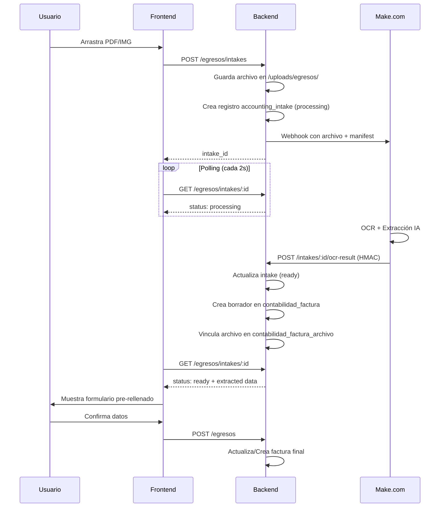

# Módulo Egresos OCR (FinSaaS)

Este módulo permite la digitalización automática de facturas de gasto (proveedores) utilizando Inteligencia Artificial a través de Make.com.

## Flujo de Trabajo



## Endpoints

| Método | Ruta | Auth | Descripción |
|--------|------|------|-------------|
| POST | `/api/contabilidad/egresos/intakes` | JWT | Inicia procesamiento OCR |
| GET | `/api/contabilidad/egresos/intakes/:id` | JWT | Consulta estado del intake |
| POST | `/api/contabilidad/intakes/:id/ocr-result` | HMAC | Callback de Make (sin JWT) |
| GET | `/api/contabilidad/egresos` | JWT | Lista gastos |
| POST | `/api/contabilidad/egresos` | JWT | Confirma/Crea gasto |

## Estructura de Datos

### Manifest enviado a Make
```json
{
  "schema_version": "1.0",
  "tenant_id": "...",
  "empresa_id": "...",
  "intake_id": "ink_123",
  "callback_url": "https://api.dominio.com/api/contabilidad/intakes/123/ocr-result",
  "document": { "tipo": "gasto", "moneda": "EUR" }
}
```

### Respuesta esperada de Make
```json
{
  "status": "extracted",
  "extracted": {
    "proveedor": "Proveedor S.L.",
    "cif_nif": "B12345678",
    "numero_factura": "F-2026-001",
    "fecha_emision": "2026-01-14",
    "base_imponible": 100,
    "iva_porcentaje": 21,
    "iva_importe": 21,
    "total": 121
  }
}
```

## Configuración

| Variable | Valor | Descripción |
|----------|-------|-------------|
| `MAKE_WEBHOOK_URL` | `https://hook.eu2.make.com/...` | URL del webhook de Make |
| `API_BASE_URL` | `https://api.tudominio.com` | URL base para callbacks |
| `MAKE_WEBHOOK_SECRET` | (secreto) | Para validación HMAC |

## Almacenamiento de Archivos

- **Local:** `/uploads/egresos/{timestamp}-{filename}`
- **Base de datos:** `file_url` en `accounting_intake` y `contabilidad_factura_archivo`

## Troubleshooting

| Síntoma | Causa | Solución |
|---------|-------|----------|
| Status "processing" infinito | Callback no llega | Verificar `API_BASE_URL` es accesible desde internet |
| 401 en callback | Ruta protegida por JWT | Callback debe estar ANTES del middleware JWT |
| Datos no aparecen en lista | Falta `id_empresa` | Verificar que se guarda correctamente |
| Campos vacíos en formulario | Mapeo de alias | Backend acepta `proveedor`/`proveedor_nombre` etc. |

## Comando Debug (Simular callback)

```bash
curl -X POST "http://localhost:3000/api/contabilidad/intakes/1/ocr-result" \
-H "Content-Type: application/json" \
-d '{
  "status": "extracted",
  "extracted": {
    "proveedor": "Test S.L.",
    "cif_nif": "B12345678",
    "numero_factura": "TEST-001",
    "fecha_emision": "2026-01-14",
    "base_imponible": 100,
    "iva_porcentaje": 21,
    "total": 121
  }
}'
```
