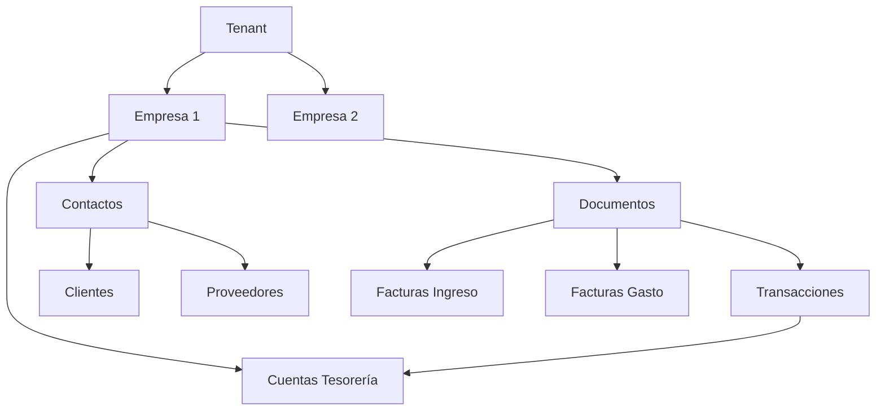

# FinSaaS: Jerarquía de Empresas Contables

## Resumen

FinSaaS implementa una jerarquía multi-empresa que permite a un tenant (cliente SaaS) gestionar múltiples sociedades o entidades fiscales desde una misma cuenta.

## Jerarquía de Datos



## Reglas de Scoping

### Backend

1. **Todo endpoint debe recibir `id_empresa`** via:
   - Header: `X-Empresa-Id`
   - Query param: `empresaId`

2. **Validación obligatoria**:
   ```javascript
   const empresaId = req.headers['x-empresa-id'] || req.query.empresaId;
   if (!empresaId) {
       return res.status(400).json({ error: 'Empresa no especificada' });
   }
   ```

3. **Queries siempre filtran por tenant + empresa**:
   ```sql
   WHERE id_tenant = $1 AND id_empresa = $2
   ```

### Frontend

1. **Selector de empresa** visible en todas las páginas
2. **Persistencia** en `localStorage` key: `finsaas_current_empresa`
3. **Headers automáticos** en todas las llamadas API:
   ```javascript
   headers['X-Empresa-Id'] = currentEmpresaId;
   ```

## Empresa Activa

El sistema determina la empresa activa en este orden:

1. Valor guardado en `localStorage`
2. Primera empresa de la lista del usuario
3. Empresa por defecto del tenant (`es_default = true`)

## Añadir Nuevas Entidades

Para entidades que deben estar scoped por empresa:

1. **Migración**: Añadir columna `id_empresa BIGINT REFERENCES accounting_empresa(id)`
2. **Índice**: `CREATE INDEX idx_[tabla]_empresa ON [tabla](id_empresa)`
3. **Controller**: Extraer `empresaId` del request
4. **Repository**: Añadir filtro `AND id_empresa = $N`
5. **Frontend**: Enviar header `X-Empresa-Id`

## Archivos Clave

| Archivo | Propósito |
|---------|-----------|
| `empresa.middleware.js` | Middleware de validación de empresa |
| `empresa.controller.js` | CRUD de empresas |
| `dashboard.controller.js` | KPIs scoped por empresa |
| `contabilidad.repo.js` | Queries con filtro empresa |
