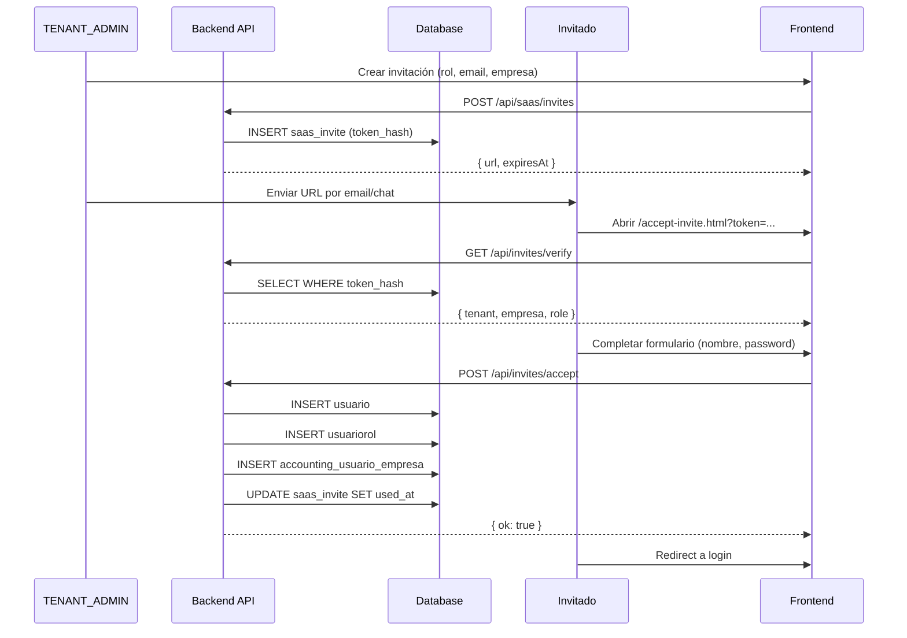

# Módulo: Invitaciones de Empresas (B2B)

## Descripción

Sistema de invitaciones B2B que permite a un TENANT_ADMIN invitar nuevos usuarios a su tenant, opcionalmente asignándolos a una empresa contable específica.

## Flujo de Invitación



## Modelo de Datos

### Tabla: `saas_invite`

| Columna | Tipo | Descripción |
|---------|------|-------------|
| id | SERIAL | Primary key |
| token_hash | VARCHAR(128) | SHA-256 hash del token (NUNCA el plaintext) |
| tenant_id | INTEGER FK | Tenant al que se invita |
| id_empresa | BIGINT FK | Empresa contable (opcional) |
| role | VARCHAR(50) | Rol a asignar (CLIENT_ADMIN, ACCOUNTANT, VIEWER) |
| email_allowed | VARCHAR(255) | Email específico (opcional, caso contrario cualquiera) |
| expires_at | TIMESTAMPTZ | Expiración del token |
| used_at | TIMESTAMPTZ | Cuándo se usó (NULL = no usado) |
| used_by_user_id | BIGINT FK | Usuario que usó el invite |
| created_by_user_id | INTEGER FK | Quién creó la invitación |
| created_at | TIMESTAMPTZ | Timestamp creación |

### Índices

- `idx_saas_invite_token` - Búsqueda por token_hash
- `idx_saas_invite_tenant` - Listado por tenant
- `idx_saas_invite_empresa` - Filtro por empresa
- `idx_saas_invite_expires` - Invites activas

## Endpoints API

### Endpoints Autenticados (TENANT_ADMIN)

#### POST /api/saas/invites
Crear nueva invitación.

**Request:**
```json
{
  "role": "CLIENT_ADMIN",
  "emailAllowed": "usuario@empresa.com",
  "empresaId": 30,
  "expiryHours": 72
}
```

**Response:**
```json
{
  "ok": true,
  "invite": {
    "id": 123,
    "url": "https://app.com/accept-invite.html?token=abc...",
    "expiresAt": "2026-01-20T12:00:00Z",
    "role": "CLIENT_ADMIN",
    "empresaId": 30
  }
}
```

#### GET /api/saas/invites
Listar invitaciones del tenant.

#### DELETE /api/saas/invites/:id
Eliminar invitación no usada.

### Endpoints Públicos (Sin auth)

#### GET /api/invites/verify
Verificar token de invitación.

**Query:** `?token=abc123...`

**Response:**
```json
{
  "ok": true,
  "invite": {
    "email": "usuario@empresa.com",
    "emailRequired": true,
    "tenant": { "id": 1, "nombre": "Gestoría ABC" },
    "empresa": { "id": 30, "nombre": "Cliente SL" },
    "role": "CLIENT_ADMIN",
    "expiresAt": "2026-01-20T12:00:00Z"
  }
}
```

#### POST /api/invites/accept
Aceptar invitación y crear cuenta.

**Request:**
```json
{
  "token": "abc123...",
  "email": "usuario@empresa.com",
  "nombre": "Juan García",
  "password": "SecurePass123!"
}
```

**Response:**
```json
{
  "ok": true,
  "message": "Cuenta creada correctamente",
  "user": { "id": 456, "email": "usuario@empresa.com" },
  "tenant": { "id": 1, "nombre": "Gestoría ABC" }
}
```

## Roles Disponibles

| Rol | Descripción |
|-----|-------------|
| `CLIENT_ADMIN` | Administrador de la empresa cliente |
| `ACCOUNTANT` | Contable con acceso a contabilidad |
| `VIEWER` | Solo lectura |
| `TENANT_ADMIN` | Administrador del tenant (solo asignable internamente) |

## Páginas Frontend

### /accept-invite.html
Página pública para aceptar invitaciones con email/password.

**Estados:**
- Loading: Verificando token
- Error: Token inválido/expirado/usado
- Form: Mostrar formulario de registro
- Success: Cuenta creada, redirigir a login

### /src/verticals/finsaas/pages/usuarios.html
Panel de gestión de invitaciones (autenticado).

**Funcionalidades:**
- Crear invitación con rol, empresa (opcional) y email (opcional)
- Seleccionar validez (24h, 3 días, 1 semana)
- Ver lista de invitaciones (activas, usadas, expiradas)
- Eliminar invitaciones no usadas
- Copiar enlace de invitación

## Seguridad

### Token
- Generación: `crypto.randomBytes(32)` (256 bits)
- Almacenamiento: Solo hash SHA-256 en DB
- Uso único: `WHERE used_at IS NULL`
- Expiración: Configurable (default 72h)

### Validaciones
- Email normalizado (lowercase, trim)
- Email único en sistema
- Token válido antes de crear cuenta
- Multi-tenant: Tenant del invite se respeta siempre

## Checklist QA

- [ ] QA-INV-01: TENANT_ADMIN puede crear invitación
- [ ] QA-INV-02: Invitación incluye empresa si se selecciona
- [ ] QA-INV-03: GET /invites/verify devuelve datos correctos
- [ ] QA-INV-04: POST /invites/accept crea usuario
- [ ] QA-INV-05: Usuario queda en tenant correcto
- [ ] QA-INV-06: Usuario asignado a empresa si aplica
- [ ] QA-INV-07: Login email/password funciona post-registro
- [ ] QA-INV-08: Token usado no funciona segunda vez
- [ ] QA-INV-09: Token expirado no funciona
- [ ] QA-INV-10: Usuario sin permisos no puede crear invites

## Archivos Relacionados

### Backend
- `services/saasInviteService.js` - Lógica de negocio
- `routes/saasInvites.js` - API autenticada
- `routes/invitePublic.js` - API pública
- `migrations/20260117_b2b_invite_flow.sql` - Migración DB

### Frontend
- `frontend/accept-invite.html` - Página de aceptación
- `frontend/src/verticals/finsaas/pages/usuarios.html` - Panel de gestión
