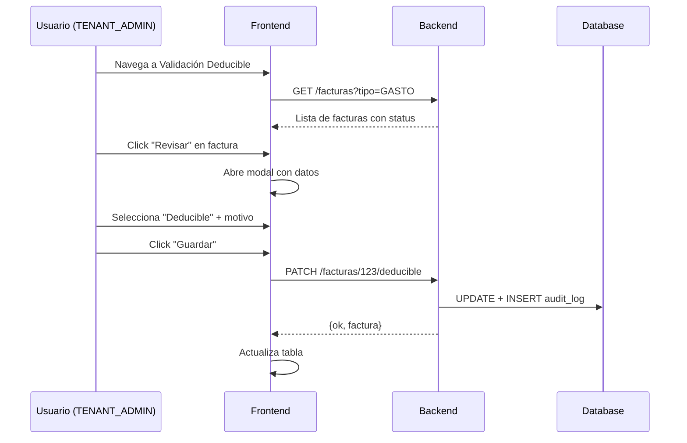

# Módulo: Validación Deducible (FinSaaS)

Funcionalidad para validar facturas de gasto como **DEDUCIBLE** o **NO DEDUCIBLE** para efectos fiscales en España.

## Reglas de Negocio

| Regla | Descripción |
|-------|-------------|
| **Solo TENANT_ADMIN** | Solo usuarios con rol `TENANT_ADMIN` y permiso `contabilidad.deducible.approve` pueden aprobar |
| **Auditoría** | Todos los cambios se registran en `accounting_audit_log` |
| **Multi-empresa** | TENANT_ADMIN puede exportar CSV de todas las empresas; empresa solo la suya |

## Estados de Deducibilidad

| Estado | Descripción |
|--------|-------------|
| `pending` | Por defecto. Aún no revisado |
| `deducible` | Aprobado como gasto deducible |
| `no_deducible` | Rechazado como gasto no deducible |

---

## Endpoints

### Actualizar estado deducible
```http
PATCH /api/contabilidad/facturas/:id/deducible
Authorization: Bearer <token>
X-Empresa-Id: <empresa_id>

{
  "deducible_status": "deducible|no_deducible|pending",
  "deducible_reason": "Motivo opcional..."
}
```

**Respuesta:**
```json
{
  "message": "Estado de deducibilidad actualizado",
  "factura": {
    "id": 123,
    "numero_factura": "FAC-001",
    "deducible_status": "deducible",
    "deducible_reason": "Gasto operativo",
    "deducible_checked_by": 1,
    "deducible_checked_at": "2026-01-17T10:30:00Z"
  }
}
```

### Historial de cambios
```http
GET /api/contabilidad/facturas/:id/deducible/history
```

### Exportar CSV
```http
GET /api/contabilidad/facturas/export.csv?empresa_id=&year=&quarter=&deducible_status=
```

**Query Parameters:**
| Param | Requerido | Descripción |
|-------|-----------|-------------|
| `empresa_id` | Solo para no-admin | ID de empresa a exportar |
| `year` | No | Año fiscal |
| `quarter` | No | Trimestre (1-4) |
| `deducible_status` | No | Filtrar por estado |

---

## Columnas CSV

```csv
tenant_id;empresa_id;empresa_nombre;proveedor;nif_cif;numero_factura;
fecha_emision;fecha_devengo;base_imponible;iva_porcentaje;iva_importe;total;
categoria;estado_pago;deducible_status;deducible_reason;
deducible_checked_at;deducible_checked_by_email;origen;file_attached
```

- **Separador**: `;` (estándar España)
- **Encoding**: UTF-8 con BOM
- **Nombre archivo**: `facturas_gasto_Q{quarter}_{year}_empresa_{id}_{status}.csv`

---

## Base de Datos

### Campos en `contabilidad_factura`
```sql
deducible_status      TEXT DEFAULT 'pending'  -- pending|deducible|no_deducible
deducible_reason      TEXT                    -- Motivo de la decisión
deducible_checked_by  BIGINT                  -- Usuario que validó
deducible_checked_at  TIMESTAMPTZ             -- Fecha/hora de validación
```

### Tabla `accounting_audit_log`
```sql
id, id_tenant, id_empresa, entity_type, entity_id, action,
before_json, after_json, performed_by, performed_at
```

---

## Permisos RBAC

| Permiso | Roles | Descripción |
|---------|-------|-------------|
| `contabilidad.deducible.approve` | TENANT_ADMIN, SUPER_ADMIN | Cambiar status deducible |
| `contabilidad.export` | TENANT_ADMIN, ACCOUNTING, SUPER_ADMIN | Exportar CSV |
| `contabilidad.read` | Todos | Ver lista facturas |

---

## Flujo UX



---

## Archivos Clave

| Archivo | Propósito |
|---------|-----------|
| `deducible.controller.js` | Lógica de PATCH y CSV export |
| `contabilidad.routes.js` | Rutas RBAC protegidas |
| `validacion-deducible.html` | UI de validación |
| `finsaas.nav.js` | Link en sidebar |
| `20260117_deducible_validation.sql` | Migración DB |
